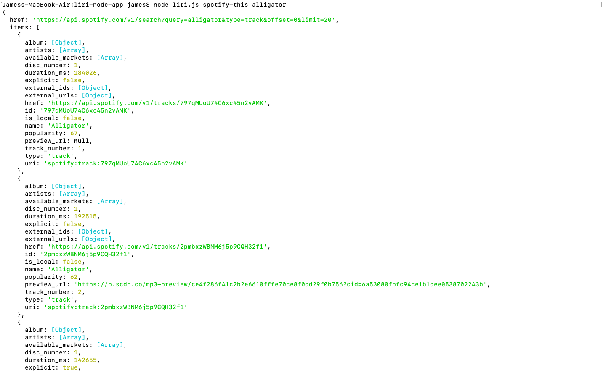
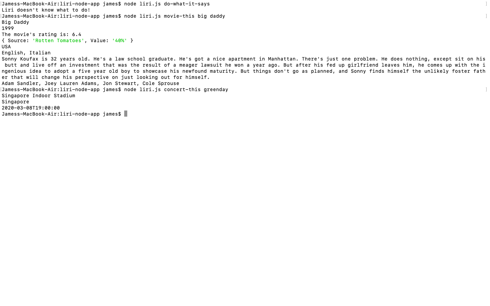

# liri-node-app
####Spotify this song returns a song search.

####When a blank search is requested. Liri doesn't know what to do is returned. 

The movie-this command searches the ombd api and returns the specified results.

The concert-this command searches to see if the band searched has any upcoming shows and displays key parameters. 

